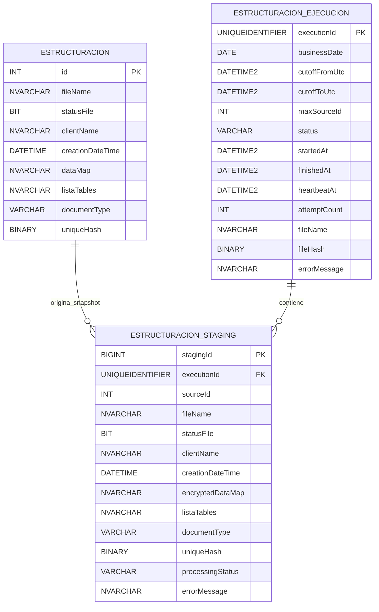
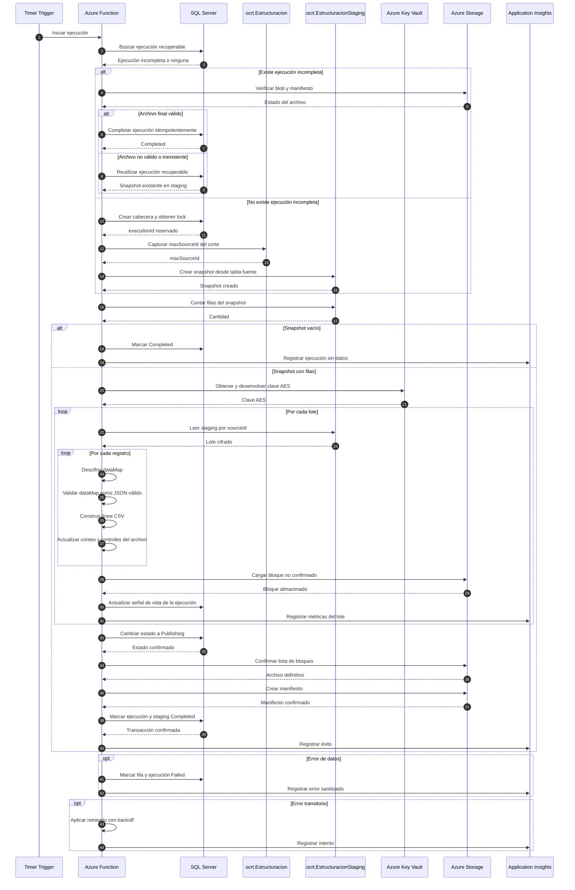
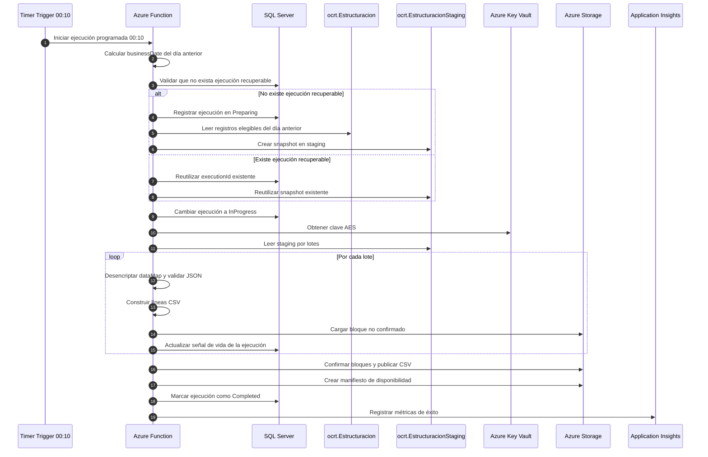

# Arquitectura: generación de archivo plano con descifrado AES/RSA

> **Rol:** Arquitectura de soluciones Azure y diseño de procesos batch.  
> **Alcance permitido:** SQL Server, Azure Functions, Azure Key Vault, Azure Storage Account y Application Insights.

## Decisión arquitectónica

La solución utiliza únicamente dos tablas técnicas:

1. `ocrt.EstructuracionEjecucion`: cabecera y control global de cada ejecución.
2. `ocrt.EstructuracionStaging`: snapshot completo de los registros que pertenecen a la ejecución.

La tabla fuente del negocio es `ocrt.Estructuracion`. Esta tabla permanece sin columnas ni estados técnicos del proceso batch.

La unidad atómica es el **archivo completo**:

- una ejecución procesa un snapshot completo;
- una fila inválida impide publicar el archivo, salvo que el negocio acepte explícitamente archivos parciales;
- una recuperación vuelve a generar el archivo desde el inicio del mismo snapshot;
- staging se usa como tabla técnica de procesamiento y se limpia al iniciar una nueva foto sin ejecución recuperable;
- la auditoría mínima del corte queda en la tabla `ocrt.EstructuracionEjecucion`.

---

## Supuestos sujetos a validación

| Código | Supuesto |
|---|---|
| S-01 | SQL Server permite autenticación de la Azure Function mediante Microsoft Entra ID y Managed Identity. |
| S-02 | La ejecución es diaria a las 00:10 hora local del negocio y procesa el día calendario anterior como `businessDate`. |
| S-03 | Todos los registros de una ejecución usan la misma clave AES, o un conjunto pequeño de claves identificables por versión. |
| S-04 | El formato criptográfico define explícitamente algoritmo AES, IV/nonce, tag, padding y codificación. |
| S-05 | Los tamaños de lote y tiempos indicados son valores iniciales sujetos a pruebas de carga. |
| S-06 | La Function se ejecuta en un plan compatible con la duración, memoria e integración de red necesarias. |
| S-07 | El consumidor requiere un archivo `.csv` codificado en UTF-8, con contrato formal de separador, comillas y saltos de línea. |

---

## 0. Regla de programación y corte de negocio

El batch se ejecuta diariamente a las **00:10 hora local del negocio**.

La ejecución siempre procesa el **día calendario anterior** a la fecha/hora de disparo del Timer Trigger.

Ejemplo:

```text
Fecha/hora de ejecución local: 2026-07-18 00:10
businessDate:                  2026-07-17
Rango local del corte:          2026-07-17 00:00:00 <= creationDateTime < 2026-07-18 00:00:00
```

Reglas obligatorias:

- `businessDate` se calcula como la fecha local de ejecución menos un día.
- `cutoffFromLocal` corresponde al inicio local de `businessDate`.
- `cutoffToLocal` corresponde al inicio local del día siguiente a `businessDate`.
- Para persistencia y trazabilidad, la cabecera guarda `cutoffFromUtc` y `cutoffToUtc`.
- Si `creationDateTime` está almacenado en UTC, el rango local debe convertirse a UTC antes de consultar SQL Server.
- Si `creationDateTime` está almacenado en hora local, la consulta debe usar directamente el rango local anterior, manteniendo en la cabecera su equivalente UTC.
- El corte debe expresarse siempre como intervalo semiabierto: `cutoffFrom <= creationDateTime < cutoffTo`.
- No se debe usar `CAST(creationDateTime AS date)` en el filtro, para no afectar el uso de índices.

Esta regla evita ambigüedad operativa cuando el proceso se ejecuta después de medianoche y garantiza que una ejecución del día actual genere la foto del día de negocio anterior.

## 1. Arquitectura recomendada

### Componentes

| Componente | Responsabilidad |
|---|---|
| Azure Function | Ejecutar el Timer Trigger diario, exponer un HTTP Trigger manual para pruebas controladas, recuperar ejecuciones incompletas, crear snapshots, obtener la clave AES, descifrar, validar, serializar, escribir bloques, confirmar el archivo y actualizar estados. |
| SQL Server | Fuente de lectura, control de ejecuciones, snapshot staging, deduplicación, recuperación e idempotencia. |
| Azure Key Vault | Custodiar la clave RSA y ejecutar el desenvolvimiento de la clave AES. |
| Azure Storage Account | Recibir bloques no confirmados, publicar el blob final y almacenar el manifiesto. |
| Application Insights | Métricas, trazas, dependencias y errores sanitizados. |

### Flujo general

1. El Timer Trigger inicia la Function a las 00:10, o un operador autorizado la inicia manualmente mediante HTTP Trigger.
2. La Function busca primero ejecuciones incompletas.
3. Si existe una ejecución recuperable:
   - reutiliza su `executionId`;
   - reutiliza el mismo snapshot;
   - vuelve a generar el archivo desde el inicio.
4. Si no existe una ejecución recuperable:
   - crea una nueva cabecera;
   - captura un límite estable del corte;
   - limpia staging porque iniciará una nueva foto;
   - copia los registros elegibles a staging.
5. Obtiene y desenvuelve la clave AES una sola vez.
6. Lee staging mediante paginación por `sourceId`.
7. Descifra, valida y serializa cada registro.
8. Carga bloques no confirmados progresivamente sin cargar el archivo completo en memoria.
9. Cambia la ejecución a `Publishing`.
10. Confirma la lista de bloques para publicar el CSV final.
11. Crea el manifiesto como señal de disponibilidad para el consumidor.
12. Marca la ejecución como `Completed`.
13. Staging queda disponible hasta que una nueva ejecución sin recuperable inicie una nueva foto.

### Tamaños iniciales

Valores iniciales sujetos a pruebas:

- lote SQL: 500 a 2 000 registros;
- cola interna de descifrado: 32 a 128 registros;
- bloque de Storage: 4 a 16 MiB;
- paralelismo de descifrado: entre 2 y 4 workers;
- objetivo de duración: 15 a 40 minutos;
- umbral de ejecución abandonada: 15 minutos sin heartbeat;
- máximo de intentos: 3.

El límite real debe controlarse también por bytes, porque `dataMap` y `listaTables` son `NVARCHAR(MAX)`.

---

## 2. Comparación: origen directo frente a staging

| Criterio | Directo desde origen | Mediante staging |
|---|---|---|
| Impacto SQL | Lectura prolongada y posibles escrituras técnicas sobre la tabla operativa. | Una lectura inicial y todo el procesamiento posterior sobre tablas técnicas. |
| Consistencia | El contenido puede cambiar entre intentos. | El snapshot permanece estable. |
| Recuperación | Requiere reconstruir el conjunto. | Se reutiliza exactamente el mismo conjunto. |
| Idempotencia | Más difícil sin modificar origen. | Se controla por ejecución y snapshot. |
| Reprocesamiento | Puede leer datos diferentes. | Regenera el mismo archivo lógico. |
| Complejidad | Menos tablas, mayor complejidad operativa. | Dos tablas técnicas, flujo más explícito. |
| Almacenamiento | Sin duplicación temporal. | Duplica temporalmente los datos del corte. |

**Recomendación:** utilizar staging. Para un batch de 200 000 registros, el costo de almacenamiento temporal se justifica por consistencia, recuperación e idempotencia.

---

## 3. Requerimientos funcionales

| Código | Requerimiento | Criterio de aceptación |
|---|---|---|
| RF-01 | Detectar ejecuciones incompletas antes de crear un nuevo corte. | Una ejecución antigua tiene prioridad sobre una nueva fecha. |
| RF-02 | Crear una ejecución única por corte. | No existen dos ejecuciones activas o exitosas para el mismo `businessDate`. |
| RF-03 | Crear snapshot sin modificar la tabla principal. | Todas las filas elegibles del día calendario anterior quedan asociadas a un `executionId`. |
| RF-04 | Leer staging por lotes usando keyset pagination. | No se usa `OFFSET`; no se omiten filas. |
| RF-04A | Calcular el corte de negocio desde la ejecución a las 00:10. | Una ejecución local del `2026-07-18 00:10` procesa exclusivamente `businessDate = 2026-07-17`. |
| RF-05 | Obtener y desenvolver la clave AES una sola vez. | No existe una llamada a Key Vault por registro. |
| RF-06 | Descifrar `dataMap`. | El plaintext coincide con vectores criptográficos de prueba. |
| RF-07 | Validar que `dataMap` desencriptado sea JSON válido. | Una fila con `dataMap` inválido impide confirmar el archivo. |
| RF-08 | Generar el archivo progresivamente. | La memoria no crece con el total de registros. |
| RF-09 | Confirmar el archivo de forma atómica. | El consumidor no observa contenido parcial. |
| RF-10 | Crear un manifiesto. | Contiene `executionId`, conteo, tamaño y SHA-256. |
| RF-11 | Actualizar estados después de publicar. | Ninguna fila queda procesada si no existe archivo válido. |
| RF-12 | Recuperar interrupciones. | Se reutilizan el mismo `executionId` y snapshot. |
| RF-13 | Evitar duplicados. | `(executionId, sourceId)` y `(executionId, uniqueHash)` son únicos. |
| RF-14 | Impedir sobrescritura. | El blob se crea con condición de no existencia. |
| RF-15 | Auditar. | Es posible conocer estado, archivo, hash, intentos y error de cada ejecución. |

---

## 4. Requerimientos no funcionales

| Código | Categoría | Objetivo inicial |
|---|---|---|
| RNF-01 | Rendimiento | 200 000 filas en 15–40 minutos, sujeto a prueba de carga. |
| RNF-02 | Memoria | Uso acotado por lote y por bytes. |
| RNF-03 | Seguridad | Sin secretos en configuración. |
| RNF-04 | Identidad | Managed Identity para SQL, Key Vault y Storage. |
| RNF-05 | Cifrado | TLS en tránsito y cifrado nativo en reposo. |
| RNF-06 | Idempotencia | Repetir una recuperación no genera un segundo archivo lógico. |
| RNF-07 | Observabilidad | Métricas por fase, lote, dependencia y ejecución. |
| RNF-08 | Recuperación | Reinicio desde el comienzo del snapshot. |
| RNF-09 | Integridad | SHA-256 calculado sobre los bytes exactos del archivo. |
| RNF-10 | Privacidad | Nunca registrar plaintext ni material criptográfico. |

---

## 5. Diseño de base de datos

### 5.1 Schema técnico

Todos los objetos técnicos y la tabla fuente se ubican bajo el schema `ocrt`.

```sql
IF NOT EXISTS
(
    SELECT 1
    FROM sys.schemas
    WHERE name = 'ocrt'
)
BEGIN
    EXEC('CREATE SCHEMA ocrt');
END;
GO
```

### 5.2 Tabla fuente de negocio

La tabla `ocrt.Estructuracion` es la fuente de negocio del batch. El proceso solo la lee para crear el snapshot; no debe agregarle columnas técnicas ni estados propios del procesamiento.

Script de referencia:

```sql
CREATE TABLE ocrt.Estructuracion
(
    id                  INT IDENTITY(1,1) NOT NULL,
    fileName            NVARCHAR(MAX) NOT NULL,
    statusFile          BIT NOT NULL,
    clientName          NVARCHAR(MAX) NOT NULL,
    creationDateTime    DATETIME NOT NULL,
    dataMap             NVARCHAR(MAX) NOT NULL,
    listaTables         NVARCHAR(MAX) NOT NULL,
    documentType        VARCHAR(50) NOT NULL,
    uniqueHash          BINARY(32) NOT NULL,

    CONSTRAINT PK_Estructuracion
        PRIMARY KEY (id)
);
GO

CREATE INDEX IX_Estructuracion_Cutoff
ON ocrt.Estructuracion
(
    statusFile,
    creationDateTime,
    id
);
GO

CREATE INDEX IX_Estructuracion_UniqueHash
ON ocrt.Estructuracion
(
    uniqueHash
);
GO
```

Notas:

- `dataMap` contiene la estructura JSON cifrada.
- `listaTables` se conserva como parte del registro fuente.
- `statusFile = 1` identifica registros elegibles para el batch.
- El filtro del corte debe usar `creationDateTime >= @CutoffFromUtc AND creationDateTime < @CutoffToUtc`.
- No se debe usar `CAST(creationDateTime AS date)` en filtros del batch.
- No se agregan columnas como `processingStatus`, `processedAt` o `executionId` en esta tabla.

### 5.3 Tabla de control de ejecución

```sql
CREATE TABLE ocrt.EstructuracionEjecucion
(
    executionId       UNIQUEIDENTIFIER NOT NULL,
    businessDate      DATE NOT NULL,
    cutoffFromUtc     DATETIME2(3) NOT NULL,
    cutoffToUtc       DATETIME2(3) NOT NULL,
    maxSourceId       INT NULL,
    firstSourceId     INT NULL,
    lastSourceId      INT NULL,
    snapshotRecordCount BIGINT NULL,

    status            VARCHAR(20) NOT NULL,
    startedAt         DATETIME2(3) NOT NULL,
    finishedAt        DATETIME2(3) NULL,
    heartbeatAt       DATETIME2(3) NULL,

    attemptCount      INT NOT NULL
        CONSTRAINT DF_EstructuracionEjecucion_Attempt DEFAULT (1),

    fileName          NVARCHAR(500) NULL,
    fileHash          BINARY(32) NULL,
    errorMessage      NVARCHAR(2000) NULL,

    CONSTRAINT PK_EstructuracionEjecucion
        PRIMARY KEY (executionId),

    CONSTRAINT CK_EstructuracionEjecucion_Status
        CHECK
        (
            status IN
            (
                'Preparing',
                'InProgress',
                'Publishing',
                'Completed',
                'Failed'
            )
        ),

    CONSTRAINT CK_EstructuracionEjecucion_Cutoff
        CHECK (cutoffFromUtc < cutoffToUtc)
);
GO

CREATE INDEX IX_EstructuracionEjecucion_StatusHeartbeat
ON ocrt.EstructuracionEjecucion
(
    status,
    heartbeatAt
);
GO

CREATE UNIQUE INDEX UX_EstructuracionEjecucion_ActiveBusinessDate
ON ocrt.EstructuracionEjecucion (businessDate)
WHERE status IN ('Preparing', 'InProgress', 'Publishing', 'Completed');
GO
```

> Si la versión o política de SQL Server no admite el filtro anterior, utilizar `sp_getapplock` y una validación transaccional equivalente.

Campos de auditoría del corte:

- `firstSourceId`: menor `id` de `ocrt.Estructuracion` incluido en el snapshot.
- `lastSourceId`: mayor `id` de `ocrt.Estructuracion` incluido en el snapshot.
- `snapshotRecordCount`: cantidad de registros capturados para la ejecución.

Estos campos permiten limpiar `ocrt.EstructuracionStaging` al iniciar una nueva foto sin perder trazabilidad básica del rango procesado.

Para usar `sp_getapplock`, construir el recurso de lock en una variable antes de ejecutar el procedimiento:

```sql
DECLARE @LockResource NVARCHAR(255);

SET @LockResource = CONCAT('EstructuracionBatch:', CONVERT(VARCHAR(10), @BusinessDate, 120));

EXEC @LockResult = sp_getapplock
    @Resource = @LockResource,
    @LockMode = 'Exclusive',
    @LockOwner = 'Transaction',
    @LockTimeout = 0;
```

### 5.4 Tabla staging

```sql
CREATE TABLE ocrt.EstructuracionStaging
(
    stagingId           BIGINT IDENTITY(1,1) NOT NULL,
    executionId         UNIQUEIDENTIFIER NOT NULL,
    sourceId            INT NOT NULL,

    fileName            NVARCHAR(MAX) NOT NULL,
    statusFile          BIT NOT NULL,
    clientName          NVARCHAR(MAX) NOT NULL,
    creationDateTime    DATETIME NOT NULL,
    encryptedDataMap    NVARCHAR(MAX) NOT NULL,
    listaTables         NVARCHAR(MAX) NOT NULL,
    documentType        VARCHAR(50) NOT NULL,
    uniqueHash          BINARY(32) NOT NULL,

    processingStatus    VARCHAR(20) NOT NULL
        CONSTRAINT DF_EstructuracionStaging_Status DEFAULT ('Pending'),

    errorMessage        NVARCHAR(2000) NULL,

    CONSTRAINT PK_EstructuracionStaging
        PRIMARY KEY (stagingId),

    CONSTRAINT FK_EstructuracionStaging_Ejecucion
        FOREIGN KEY (executionId)
        REFERENCES ocrt.EstructuracionEjecucion(executionId),

    CONSTRAINT UQ_EstructuracionStaging_ExecutionSource
        UNIQUE (executionId, sourceId),

    CONSTRAINT UQ_EstructuracionStaging_ExecutionHash
        UNIQUE (executionId, uniqueHash),

    CONSTRAINT CK_EstructuracionStaging_Status
        CHECK
        (
            processingStatus IN
            (
                'Pending',
                'Failed'
            )
        )
);
GO

CREATE INDEX IX_EstructuracionStaging_ExecutionSource
ON ocrt.EstructuracionStaging
(
    executionId,
    sourceId
);
GO

CREATE INDEX IX_EstructuracionStaging_ExecutionStatusSource
ON ocrt.EstructuracionStaging
(
    executionId,
    processingStatus,
    sourceId
);
GO
```

### 5.5 Decisiones del modelo

- No se crea FK desde staging hacia `ocrt.Estructuracion`.
- `sourceId` es una referencia lógica.
- No se agrega estado `InProgress` por registro.
- Los intentos pertenecen a la ejecución, no a cada fila.
- Los conteos se obtienen desde staging.
- Staging se conserva hasta que una nueva ejecución sin recuperable cargue una nueva foto.
- La tabla principal no recibe columnas técnicas.

### 5.6 Modelo de datos



---

## 6. Estrategia de procesamiento

### 6.1 Recuperar antes de iniciar un nuevo corte

```sql
SELECT TOP (1)
       executionId,
       businessDate,
       cutoffFromUtc,
       cutoffToUtc,
       status,
       fileName,
       fileHash
FROM ocrt.EstructuracionEjecucion
WHERE status IN ('Preparing', 'InProgress', 'Publishing', 'Failed')
  AND
  (
      status = 'Failed'
      OR heartbeatAt < DATEADD(MINUTE, -@StaleMinutes, SYSUTCDATETIME())
  )
ORDER BY startedAt;
```

Reglas:

- `Publishing` con blob y manifiesto válidos: completar SQL.
- `Preparing`, `InProgress` o `Failed` sin archivo válido: reiniciar el mismo snapshot.
- No iniciar el nuevo corte mientras exista una ejecución recuperable.

### 6.2 Crear una nueva ejecución

1. Generar `executionId`.
2. Calcular `businessDate` como el día calendario anterior a la ejecución local de las 00:10.
3. Calcular `cutoffFromLocal` y `cutoffToLocal` como intervalo semiabierto del `businessDate`; convertirlos a `cutoffFromUtc` y `cutoffToUtc` para guardar la cabecera y consultar SQL Server si `creationDateTime` está almacenado en UTC.
4. Obtener un lock aplicativo.
5. Limpiar `ocrt.EstructuracionStaging` porque no se conserva historial en staging.
6. Insertar la cabecera en `Preparing`.
7. Capturar `maxSourceId`.
8. Crear el snapshot.
9. Cambiar el estado a `InProgress`.

### 6.3 Capturar un límite estable

```sql
SELECT @MaxSourceId = MAX(id)
FROM ocrt.Estructuracion
WHERE creationDateTime >= @CutoffFromUtc
  AND creationDateTime <  @CutoffToUtc
  AND statusFile = 1;
```

El snapshot utiliza ese límite:

```sql
DELETE FROM ocrt.EstructuracionStaging;

INSERT INTO ocrt.EstructuracionStaging
(
    executionId,
    sourceId,
    fileName,
    statusFile,
    clientName,
    creationDateTime,
    encryptedDataMap,
    listaTables,
    documentType,
    uniqueHash
)
SELECT
    @ExecutionId,
    e.id,
    e.fileName,
    e.statusFile,
    e.clientName,
    e.creationDateTime,
    e.dataMap,
    e.listaTables,
    e.documentType,
    e.uniqueHash
FROM ocrt.Estructuracion e
WHERE e.statusFile = 1
  AND e.id <= @MaxSourceId
  AND e.creationDateTime >= @CutoffFromUtc
  AND e.creationDateTime <  @CutoffToUtc
ORDER BY e.id;
```

No se utiliza:

```sql
CAST(creationDateTime AS date)
```

porque dificulta el uso eficiente de índices. El filtro debe usar límites pre calculados del día de negocio anterior, preferiblemente normalizados a UTC cuando la columna origen esté en UTC.

### 6.4 Obtener la clave AES

La Function debe:

1. autenticarse con Managed Identity;
2. leer el material AES envuelto;
3. ejecutar `unwrapKey` con la versión concreta de la clave RSA;
4. conservar la clave AES solo en memoria;
5. reutilizarla durante la ejecución;
6. limpiar el arreglo mutable en un bloque `finally`.

No se realiza una llamada a Key Vault por fila.

### 6.5 Leer por lotes

Cada nuevo intento comienza con:

```text
lastSourceId = 0
```

Consulta:

```sql
SELECT TOP (@BatchSize)
       stagingId,
       sourceId,
       fileName,
       statusFile,
       clientName,
       creationDateTime,
       encryptedDataMap,
       listaTables,
       documentType,
       uniqueHash
FROM ocrt.EstructuracionStaging
WHERE executionId = @ExecutionId
  AND sourceId > @LastSourceId
ORDER BY sourceId;
```

Después de procesar el lote:

```text
lastSourceId = máximo sourceId leído
```

`lastSourceId` vive en memoria. No se utiliza para continuar un archivo parcial después de una interrupción.

### 6.6 Descifrar y validar

Por cada fila:

1. descifrar `encryptedDataMap`;
2. validar autenticación criptográfica;
3. validar que el `dataMap` desencriptado sea JSON válido;
4. compactar el JSON para escribirlo como columna CSV;
5. construir la línea CSV;
6. actualizar conteo y controles del archivo;
7. escribir al buffer.

Si una fila falla:

- marcarla como `Failed`;
- registrar un error sanitizado;
- abortar la publicación;
- marcar la ejecución como `Failed`.

### 6.7 Señal de vida de la ejecución

La señal de vida indica que la ejecución sigue activa y procesando lotes. Técnicamente se registra en la columna `heartbeatAt`.

Actualizar después de cada lote:

```sql
UPDATE ocrt.EstructuracionEjecucion
SET heartbeatAt = SYSUTCDATETIME()
WHERE executionId = @ExecutionId
  AND status = 'InProgress';
```

### 6.8 Publicación

Antes de confirmar el archivo:

```sql
UPDATE ocrt.EstructuracionEjecucion
SET status = 'Publishing',
    heartbeatAt = SYSUTCDATETIME()
WHERE executionId = @ExecutionId
  AND status = 'InProgress';
```

Si `@@ROWCOUNT = 0`, la transición falla y no debe confirmarse el blob.

Después:

1. confirmar la lista de bloques;
2. verificar propiedades;
3. crear el manifiesto;
4. ejecutar la actualización final de SQL.

### 6.9 Confirmación final

```sql
CREATE OR ALTER PROCEDURE ocrt.usp_CompleteEstructuracionExecution
    @ExecutionId UNIQUEIDENTIFIER,
    @FileName NVARCHAR(500),
    @FileHash BINARY(32)
AS
BEGIN
    SET NOCOUNT ON;
    SET XACT_ABORT ON;

    BEGIN TRANSACTION;

    UPDATE ocrt.EstructuracionEjecucion
       SET status = 'Completed',
           finishedAt = SYSUTCDATETIME(),
           heartbeatAt = SYSUTCDATETIME(),
           fileName = @FileName,
           fileHash = @FileHash,
           errorMessage = NULL
     WHERE executionId = @ExecutionId
       AND status = 'Publishing';

    IF @@ROWCOUNT = 0
        THROW 51000, 'La ejecución no está en Publishing.', 1;

    COMMIT TRANSACTION;
END;
GO
```

### 6.10 Retención

`ocrt.EstructuracionStaging` es una tabla técnica de procesamiento, no la fuente principal de auditoría histórica.

Política inicial sugerida:

- nueva ejecución sin recuperable: limpiar `ocrt.EstructuracionStaging` antes de cargar la nueva foto;
- ejecución recuperable: conservar staging para reusar el mismo snapshot;
- `Completed`, `Failed` o `Publishing`: no limpiar staging en el cierre de la ejecución;
- auditoría histórica: conservar cabecera en `ocrt.EstructuracionEjecucion` con `firstSourceId`, `lastSourceId`, `snapshotRecordCount`, archivo, hash y estado.

Ejemplo:

```sql
DELETE FROM ocrt.EstructuracionStaging;
```

---

## 7. Generación del archivo

### Formato recomendado

El resultado final del batch debe ser un archivo **CSV**.

Contrato inicial recomendado:

- extensión `.csv`;
- codificación UTF-8 sin BOM;
- separador de columnas `,`;
- salto de línea `LF`;
- primera línea con encabezados;
- valores nulos representados como campo vacío;
- fechas en formato ISO 8601;
- campos de texto entre comillas cuando contengan coma, comillas dobles, CR o LF;
- comillas dobles internas escapadas duplicándolas;
- `dataMap` descifrado, validado como JSON y compactado antes de escribirlo como una columna CSV;
- `listaTables` compactado antes de escribirlo como una columna CSV.

Columnas iniciales:

```text
id,fileName,statusFile,clientName,creationDateTime,dataMap,listaTables,documentType,uniqueHash
```

Ejemplo:

```csv
id,fileName,statusFile,clientName,creationDateTime,dataMap,listaTables,documentType,uniqueHash
1,documento.pdf,true,Cliente,2026-07-15T10:00:00Z,"{""campo"":""valor""}","[""tabla1""]",FACTURA,A1B2
```

El CSV debe generarse mediante streaming. No se debe construir el archivo completo en memoria.

### Escritura progresiva

Usar un block blob con bloques no confirmados. El archivo final no debe quedar visible para el consumidor mientras el proceso aún está construyendo el contenido.

1. serializar registros hasta alcanzar el tamaño de bloque;
2. cargar el bloque como no confirmado;
3. conservar el ID del bloque;
4. reutilizar el buffer;
5. confirmar la lista completa al final mediante `CommitBlockList`;
6. crear el manifiesto después de publicar el CSV.

No construir una lista de 200 000 DTO ni un `StringBuilder` global.

El consumidor debe considerar disponible el archivo únicamente cuando exista el manifiesto correspondiente y sus controles coincidan con el CSV publicado.

### Nombre recomendado

```text
exports/estructuracion/businessDate=YYYY-MM-DD/
estructuracion_YYYYMMDD_{executionId}.csv
```

Manifiesto:

```text
estructuracion_YYYYMMDD_{executionId}.manifest.json
```

El manifiesto funciona como señal de disponibilidad. Si el CSV existe pero el manifiesto no existe o no coincide, el archivo no debe ser consumido.

### Evitar sobrescritura

Crear con condición equivalente a:

```text
If-None-Match: *
```

Si el blob ya existe:

- mismo `executionId` y hash: tratar como reconciliación idempotente;
- contenido diferente: fallar.

### Manifiesto

```json
{
  "executionId": "00000000-0000-0000-0000-000000000000",
  "businessDate": "2026-07-15",
  "recordCount": 200000,
  "contentLength": 123456789,
  "sha256": "base64-o-hex",
  "contentType": "text/csv; charset=utf-8",
  "generatedAtUtc": "2026-07-16T05:00:00Z"
}
```

---

## 8. Manejo de errores e idempotencia

| Riesgo | Mitigación |
|---|---|
| Dos ejecuciones para el mismo corte | Lock aplicativo y restricción de unicidad. |
| Registro duplicado dentro del snapshot | `UNIQUE (executionId, sourceId)` y `UNIQUE (executionId, uniqueHash)`. |
| Archivo parcial | Bloques no confirmados, `CommitBlockList` al final y consumo condicionado al manifiesto. |
| Fila inválida | No confirmar el archivo; ejecución `Failed`. |
| Interrupción antes de publicar | Regenerar desde el inicio del snapshot. |
| Interrupción después de publicar | Reconciliar blob y manifiesto y completar SQL. |
| Sobrescritura | Condición de creación y nombre por `executionId`. |
| Pérdida de auditoría | Retención de staging. |
| Clave AES solicitada por fila | Unwrap una sola vez y reutilización local. |

### Reintentos transitorios

Aplicar backoff exponencial con jitter:

- 3 a 5 intentos;
- inicio: 1 a 2 segundos;
- máximo: 30 segundos.

Reintentar:

- timeouts;
- HTTP 429;
- HTTP 5xx;
- deadlocks;
- errores de red transitorios.

No reintentar automáticamente:

- JSON inválido;
- autenticación AES fallida;
- clave o versión inexistente;
- permisos denegados;
- colisión de blob con contenido diferente.

---

## 9. Seguridad

| Área | Recomendación |
|---|---|
| Managed Identity | Una identidad para la Function, sin credenciales embebidas. |
| Key Vault | Solo permisos para obtener la referencia requerida y ejecutar `unwrapKey`. |
| SQL Server | Usuario Entra con `SELECT` sobre origen y `EXECUTE` sobre procedimientos técnicos. |
| Storage | Rol de datos sobre un contenedor dedicado. |
| Red | Private Endpoints y VNET Integration. |
| TLS | TLS 1.2 o superior y validación de certificados. |
| Clave AES | Variable local, no estática, sin logs, limpieza en `finally`. |
| Logs | Nunca incluir plaintext, ciphertext completo ni claves. |
| Application Insights | Correlación por `executionId`; métricas y errores sanitizados. |

---

## 10. Diagrama de secuencia



### 10.1 Diagrama de secuencia - Happy path

Este flujo representa la primera implementación objetivo de forma resumida: no existe ejecución incompleta, el snapshot contiene registros válidos, la clave se obtiene correctamente y el archivo CSV se publica sin errores.



### 10.1.1 Ejecución manual para pruebas

Para pruebas a demanda se habilita un HTTP Trigger administrativo que reutiliza el mismo servicio batch. No debe duplicar lógica ni saltarse los controles de recuperación, snapshot, publicación y cierre.

```text
POST /api/estructuracion/batch/run
```

Reglas:

- El endpoint debe usar autorización `FUNCTION`.
- El endpoint solo debe habilitarse para ambientes de desarrollo, QA o soporte controlado.
- La ejecución manual debe respetar la misma regla de `businessDate` del día anterior.
- La ejecución manual debe validar primero que no exista una ejecución recuperable.
- El endpoint no debe recibir datos sensibles en el body.

### 10.2 Diagrama de clases para implementación

Este diagrama propone una separación inicial de responsabilidades para implementar el happy path sin mezclar acceso a datos, criptografía, generación CSV, publicación en Storage y orquestación.

```mermaid
classDiagram
    class EstructuracionBatchFunction {
        +Run(timerInfo)
    }

    class EstructuracionBatchOrchestrator {
        +ExecuteAsync(cancellationToken)
        -CalculateBusinessDate()
        -ProcessBatchesAsync(execution)
    }

    class ExecutionRepository {
        +FindRecoverableExecutionAsync()
        +CreateExecutionWithSnapshotAsync(cutoff)
        +MarkInProgressAsync(executionId)
        +UpdateHeartbeatAsync(executionId)
        +MarkPublishingAsync(executionId)
        +CompleteExecutionAsync(result)
        +FailExecutionAsync(error)
    }

    class StagingRepository {
        +CountAsync(executionId)
        +ReadBatchAsync(executionId, lastSourceId, batchSize)
        +MarkRowFailedAsync(stagingId, error)
    }

    class CryptoService {
        +UnwrapAesKeyAsync(keyVersion)
        +DecryptDataMap(encryptedDataMap, aesKey)
        +ClearKey(aesKey)
    }

    class DataMapValidator {
        +ValidateJson(dataMapPlainText)
        +CompactJson(dataMapPlainText)
    }

    class CsvFileWriter {
        +WriteHeader()
        +WriteRow(record, compactDataMap)
        +FlushBlockIfNeededAsync()
        +CompleteAsync()
    }

    class BlobPublisher {
        +StageBlockAsync(block)
        +CommitBlocksAsync(fileName, blockIds)
        +CreateManifestAsync(manifest)
        +ExistsAsync(fileName)
    }

    class TelemetryService {
        +TrackBatchStarted(execution)
        +TrackBatchProcessed(metrics)
        +TrackBatchCompleted(result)
        +TrackBatchFailed(error)
    }

    class BusinessDateCutoff {
        +Date businessDate
        +DateTime cutoffFromLocal
        +DateTime cutoffToLocal
        +DateTime cutoffFromUtc
        +DateTime cutoffToUtc
    }

    class ExecutionContext {
        +Guid executionId
        +Date businessDate
        +DateTime cutoffFromUtc
        +DateTime cutoffToUtc
        +string status
        +int attemptCount
    }

    class StagingRecord {
        +long stagingId
        +int sourceId
        +string fileName
        +bool statusFile
        +string clientName
        +DateTime creationDateTime
        +string encryptedDataMap
        +string listaTables
        +string documentType
        +byte[] uniqueHash
    }

    class BatchResult {
        +Guid executionId
        +string fileName
        +string manifestFileName
        +long recordCount
        +long contentLength
        +byte[] fileHash
    }

    EstructuracionBatchFunction --> EstructuracionBatchOrchestrator
    EstructuracionBatchOrchestrator --> ExecutionRepository
    EstructuracionBatchOrchestrator --> StagingRepository
    EstructuracionBatchOrchestrator --> CryptoService
    EstructuracionBatchOrchestrator --> DataMapValidator
    EstructuracionBatchOrchestrator --> CsvFileWriter
    EstructuracionBatchOrchestrator --> BlobPublisher
    EstructuracionBatchOrchestrator --> TelemetryService

    EstructuracionBatchOrchestrator ..> BusinessDateCutoff
    EstructuracionBatchOrchestrator ..> ExecutionContext
    StagingRepository ..> StagingRecord
    CsvFileWriter ..> StagingRecord
    CsvFileWriter ..> BatchResult
    BlobPublisher ..> BatchResult
    ExecutionRepository ..> BatchResult
```



Responsabilidades principales:

- `EstructuracionBatchFunction`: punto de entrada del Timer Trigger.
- `EstructuracionBatchOrchestrator`: coordina el flujo del batch y aplica la regla de negocio.
- `ExecutionRepository`: administra la cabecera, estados, señal de vida de la ejecución y cierre transaccional.
- `StagingRepository`: lee los registros del snapshot por lotes.
- `CryptoService`: obtiene la clave AES y desencripta `dataMap`.
- `DataMapValidator`: valida y compacta el JSON desencriptado.
- `CsvFileWriter`: construye el CSV por streaming.
- `BlobPublisher`: publica bloques, archivo final y manifiesto.
- `TelemetryService`: registra métricas, trazas y errores sanitizados.

### 10.3 Diagrama de paquetes Java

La implementación Java utilizará una arquitectura por capas simple. Esta estructura es adecuada porque el proceso es un batch con un único punto de entrada programado, sin API REST ni múltiples interfaces de entrada.

```mermaid
classDiagram
    namespace com.empresa.estructuracion.batch.function {
        class EstructuracionBatchFunction
    }

    namespace com.empresa.estructuracion.batch.service {
        class EstructuracionBatchService
        class DataMapCryptoService
        class CsvWriterService
        class StoragePublisherService
        class ManifestWriterService
        class BatchTelemetryService
    }

    namespace com.empresa.estructuracion.batch.service.impl {
        class CryptoService
        class CsvGenerationService
        class BlobStorageService
        class ManifestService
        class TelemetryService
    }

    namespace com.empresa.estructuracion.batch.repository {
        class ExecutionRepository
        class StagingRepository
    }

    namespace com.empresa.estructuracion.batch.repository.impl {
        class SqlExecutionRepository
        class SqlStagingRepository
        class EstructuracionExecutionRowMapper
        class StagingRecordRowMapper
    }

    namespace com.empresa.estructuracion.batch.model {
        class BusinessDateCutoff
        class ExecutionContext
        class StagingRecord
        class BatchResult
        class BatchError
        class Manifest
    }

    namespace com.empresa.estructuracion.batch.config {
        class BatchProperties
        class DependencyConfig
        class SqlConnectionProvider
        class SqlConfig
        class StorageConfig
        class KeyVaultConfig
    }

    namespace com.empresa.estructuracion.batch.util {
        class BusinessDateCalculator
        class JsonUtils
        class CsvUtils
        class HashUtils
        class FileNameUtils
    }

    namespace com.empresa.estructuracion.batch.exception {
        class BatchException
        class DataMapInvalidException
        class CryptoException
        class StoragePublicationException
        class RepositoryException
    }

    EstructuracionBatchFunction --> EstructuracionBatchService

    EstructuracionBatchService --> ExecutionRepository
    EstructuracionBatchService --> StagingRepository
    EstructuracionBatchService --> DataMapCryptoService
    EstructuracionBatchService --> CsvWriterService
    EstructuracionBatchService --> StoragePublisherService
    EstructuracionBatchService --> ManifestWriterService
    EstructuracionBatchService --> BatchTelemetryService
    EstructuracionBatchService --> BatchProperties

    EstructuracionBatchService --> BusinessDateCutoff
    EstructuracionBatchService --> ExecutionContext
    EstructuracionBatchService --> StagingRecord
    EstructuracionBatchService --> BatchResult

    SqlExecutionRepository ..|> ExecutionRepository
    SqlStagingRepository ..|> StagingRepository
    CryptoService ..|> DataMapCryptoService
    CsvGenerationService ..|> CsvWriterService
    BlobStorageService ..|> StoragePublisherService
    ManifestService ..|> ManifestWriterService
    TelemetryService ..|> BatchTelemetryService

    SqlExecutionRepository --> SqlConnectionProvider
    SqlStagingRepository --> SqlConnectionProvider
    SqlExecutionRepository --> EstructuracionExecutionRowMapper
    SqlStagingRepository --> StagingRecordRowMapper
    SqlExecutionRepository --> ExecutionContext
    SqlStagingRepository --> StagingRecord

    CryptoService --> CryptoException
    CsvGenerationService --> CsvUtils
    CsvGenerationService --> JsonUtils
    CsvGenerationService --> HashUtils
    CsvGenerationService --> BatchResult
    BlobStorageService --> StoragePublicationException
    ManifestService --> Manifest
    TelemetryService --> BatchError

    BusinessDateCalculator --> BusinessDateCutoff
    FileNameUtils --> ExecutionContext
    DependencyConfig --> SqlConnectionProvider
    SqlConnectionProvider --> SqlConfig
    DependencyConfig --> StorageConfig
    DependencyConfig --> KeyVaultConfig
```



Paquetes recomendados:

- `function`: contiene el Timer Trigger, el HTTP Trigger manual de pruebas y delega al orquestador.
- `service`: contiene la lógica del proceso batch y las interfaces de servicios técnicos.
- `service.impl`: contiene implementaciones concretas de criptografía, CSV, Storage, manifiesto y telemetría.
- `repository`: contiene interfaces de repositorio.
- `repository.impl`: contiene implementaciones SQL, procedimientos, consultas y mapeo de resultados.
- `model`: contiene objetos de datos del proceso.
- `config`: centraliza construcción de dependencias, lectura de propiedades y el proveedor único de conexión SQL.
- `util`: contiene helpers puros y sin estado, como fechas, JSON, CSV, hash y nombres de archivo.
- `exception`: contiene excepciones propias del batch.

Regla de diseño:

- `function` no contiene lógica de negocio; solo recibe el disparo del Timer.
- `service` coordina el caso de uso y aplica las reglas del proceso.
- `service` debe depender de interfaces para facilitar pruebas unitarias y sustitución de implementaciones.
- Las implementaciones concretas de servicios deben vivir en `service.impl`.
- `repository` no contiene lógica de negocio; solo acceso a datos.
- Las implementaciones concretas de repositorios deben vivir en `repository.impl`.
- La conexión a SQL Server debe centralizarse en `config.SqlConnectionProvider`; los repositorios no deben crear conexiones directamente con `DriverManager`.
- `util` no debe convertirse en un contenedor de lógica del batch; solo debe tener funciones auxiliares pequeñas y reutilizables.
- `model` no debe depender de Azure, SQL Server ni librerías de infraestructura.

Se adopta arquitectura por capas por tratarse de un proceso batch con un único punto de entrada programado. Una arquitectura hexagonal puede considerarse si el proceso evoluciona hacia un microservicio, múltiples interfaces de entrada o reglas de dominio más complejas.

---

## 11. Aprovisionamiento de infraestructura

Antes de ejecutar el batch deben existir los recursos de Azure, objetos SQL y configuraciones necesarias. Esta sección describe el aprovisionamiento mínimo recomendado.

### 11.1 Convención de nombres

Se usará la siguiente convención inicial:

```text
{tipo}-{dominio}-{componente}-{ambiente}
```

Para recursos con restricciones de Azure, como Storage Account, se usará una variante sin guiones y en minúsculas.

Nombres definidos para ambiente `dev`:

| Recurso | Nombre |
|---|---|
| Resource Group | `rg-estructuracion-batch-dev` |
| Function App | `func-estructuracion-batch-dev` |
| App Service Plan | `asp-estructuracion-batch-dev` |
| Storage Account | `stesbatchdev001` |
| Storage Container | `exports` |
| Key Vault | `kv-estruct-batch-dev` |
| RSA Key | `rsa-estruct-batch-key` |
| Secret AES envuelta | `wrapped-aes-key` |
| Application Insights | `appi-estructuracion-batch-dev` |
| SQL technical schema | `ocrt` |

Nombres equivalentes para otros ambientes:

| Ambiente | Resource Group | Function App | Storage Account | Key Vault |
|---|---|---|---|---|
| `dev` | `rg-estructuracion-batch-dev` | `func-estructuracion-batch-dev` | `stesbatchdev001` | `kv-estruct-batch-dev` |
| `qas` | `rg-estructuracion-batch-qas` | `func-estructuracion-batch-qas` | `stesbatchqas001` | `kv-estruct-batch-qas` |
| `prd` | `rg-estructuracion-batch-prd` | `func-estructuracion-batch-prd` | `stesbatchprd001` | `kv-estruct-batch-prd` |

Variables resultantes para `dev`:

```text
BATCH_STORAGE_CONTAINER=exports
BATCH_STORAGE_BASE_PATH=estructuracion
BATCH_KEY_VAULT_URL=https://kv-estruct-batch-dev.vault.azure.net/
BATCH_RSA_KEY_NAME=rsa-estruct-batch-key
BATCH_WRAPPED_AES_SECRET_NAME=wrapped-aes-key
```

### 11.2 Azure Storage Account

Objetivo: almacenar el CSV final, bloques no confirmados durante la generación y el manifiesto de disponibilidad.

Pasos:

1. Crear un Storage Account dedicado o reutilizar uno aprobado por arquitectura.
2. Crear un contenedor dedicado, por ejemplo `exports`.
3. Deshabilitar acceso público al contenedor.
4. Habilitar cifrado en reposo nativo de Storage.
5. Definir la ruta base del batch:

```text
estructuracion/
```

6. Confirmar convención final de salida:

```text
exports/estructuracion/businessDate=YYYY-MM-DD/
estructuracion_YYYYMMDD_{executionId}.csv
estructuracion_YYYYMMDD_{executionId}.manifest.json
```

7. Configurar permisos para que la Azure Function pueda escribir blobs y leer propiedades.
8. Confirmar política de retención, lifecycle management o limpieza de archivos antiguos si aplica.

Variables asociadas:

```text
BATCH_STORAGE_CONNECTION_STRING
BATCH_STORAGE_CONTAINER=exports
BATCH_STORAGE_BASE_PATH=estructuracion
```

### 11.3 Azure Key Vault

Objetivo: custodiar la clave RSA y el secret que contiene la clave AES envuelta.

Pasos:

1. Crear o seleccionar un Key Vault.
2. Deshabilitar acceso público si la política corporativa exige Private Endpoint.
3. Crear o importar una clave RSA.
4. Definir el algoritmo de envolvimiento:

```text
RSA-OAEP
```

5. Habilitar versionamiento de la clave.
6. Definir política de rotación de la clave RSA.
7. Conceder a la Azure Function permisos mínimos para:

```text
keys/unwrapKey
secrets/get
```

Variables asociadas:

```text
BATCH_KEY_VAULT_URL=https://{key-vault-name}.vault.azure.net/
BATCH_RSA_KEY_NAME={rsa-key-name}
BATCH_WRAPPED_AES_SECRET_NAME={wrapped-aes-secret-name}
```

### 11.4 Creación de la AES envuelta con RSA

Objetivo: generar o recibir la clave AES simétrica, envolverla con la clave RSA de Key Vault y guardarla como secret.

Flujo recomendado:

```text
AES key
  -> wrap con RSA en Key Vault usando RSA-OAEP
  -> resultado wrappedAesKey
  -> codificar en base64
  -> guardar como secret en Key Vault
```

Pasos:

1. Generar una clave AES de tamaño aprobado, por ejemplo 256 bits.
2. Usar la clave RSA de Key Vault para envolver la AES.
3. Codificar el resultado en base64.
4. Guardar el valor base64 como secret.
5. Registrar internamente:

```text
RSA key name
RSA key version
wrap algorithm
secret name
fecha de generación
responsable
```

Ejemplo conceptual del valor guardado:

```text
Secret name: wrapped-aes-key
Secret value: base64(wrappedAesKey)
RSA key: rsa-estructuracion-batch
Wrap algorithm: RSA-OAEP
```

Reglas:

- No guardar la AES en texto plano.
- No registrar la AES en logs.
- No incluir la AES en configuración de la Function.
- No hacer unwrap por registro; se hace una sola vez por ejecución.
- Limpiar la AES de memoria al finalizar la ejecución.

### 11.5 Azure Function App

Objetivo: hospedar el Timer Trigger Java 21 que ejecuta el batch diariamente.

Pasos:

1. Crear la Function App con runtime Java 21.
2. Configurar Timer Trigger:

```text
0 10 0 * * *
```

3. Configurar zona horaria operativa del batch:

```text
America/Lima
```

4. Usar un plan compatible con duración, memoria, red y volumen esperado.
5. Configurar Application Insights.
6. Configurar variables de entorno.
7. Configurar acceso de red hacia SQL Server, Storage Account y Key Vault.
8. Confirmar que no existan múltiples instancias ejecutando el mismo corte sin control de lock SQL.

Variables mínimas:

```text
AzureWebJobsStorage=...
FUNCTIONS_WORKER_RUNTIME=java
BATCH_TIMER_CRON=0 10 0 * * *
BATCH_ZONE_ID=America/Lima
BATCH_SQL_CONNECTION_STRING=...
BATCH_SQL_BATCH_SIZE=1000
BATCH_SQL_STALE_MINUTES=15
BATCH_SQL_MAX_ATTEMPTS=3
BATCH_STORAGE_CONNECTION_STRING=...
BATCH_STORAGE_CONTAINER=exports
BATCH_STORAGE_BASE_PATH=estructuracion
BATCH_KEY_VAULT_URL=...
BATCH_RSA_KEY_NAME=...
BATCH_WRAPPED_AES_SECRET_NAME=...
```

### 11.5.1 Catálogo de variables de entorno

| Variable | Obligatoria | Valor inicial / ejemplo | Uso |
|---|---:|---|---|
| `AzureWebJobsStorage` | Sí | `UseDevelopmentStorage=true` en local o connection string de Storage en Azure | Requerida por Azure Functions para runtime, locks internos y triggers. |
| `FUNCTIONS_WORKER_RUNTIME` | Sí | `java` | Indica al host de Azure Functions que debe usar worker Java. |
| `BATCH_TIMER_CRON` | Sí | `0 10 0 * * *` | Programación del Timer Trigger. Para 00:10 diaria. |
| `BATCH_ZONE_ID` | No | `America/Lima` | Zona horaria usada para calcular `businessDate` del día anterior. |
| `BATCH_SQL_CONNECTION_STRING` | Sí | `jdbc:sqlserver://...` | Cadena JDBC hacia SQL Server. Debe administrarse como secreto. |
| `BATCH_SQL_BATCH_SIZE` | No | `1000` | Tamaño de lote para leer staging por `sourceId`. |
| `BATCH_SQL_STALE_MINUTES` | No | `15` | Minutos sin señal de vida para considerar recuperable una ejecución incompleta. |
| `BATCH_SQL_MAX_ATTEMPTS` | No | `3` | Reservada para fase de reintentos controlados. En la primera fase queda documentada, pero no limita intentos. |
| `BATCH_STORAGE_CONNECTION_STRING` | Sí | `DefaultEndpointsProtocol=...` | Cadena de conexión del Storage donde se publica el archivo y manifiesto. Debe administrarse como secreto. |
| `BATCH_STORAGE_CONTAINER` | Sí | `exports` | Contenedor destino del archivo y manifiesto. |
| `BATCH_STORAGE_BASE_PATH` | No | `estructuracion` | Prefijo lógico dentro del contenedor. |
| `BATCH_KEY_VAULT_URL` | Sí | `https://kv-estruct-batch-dev.vault.azure.net/` | URL del Key Vault que contiene la RSA y el secret de AES envuelta. |
| `BATCH_RSA_KEY_NAME` | Sí | `rsa-estruct-batch-key` | Nombre de la clave RSA usada para desenvolver la AES. |
| `BATCH_WRAPPED_AES_SECRET_NAME` | Sí | `wrapped-aes-key` | Nombre del secret que contiene la AES envuelta en Base64. |

Notas de seguridad:

- Ninguna variable con credenciales debe quedar en repositorio.
- `local.settings.json` debe mantenerse excluido de Git.
- En Azure, preferir App Settings referenciando Key Vault o Managed Identity cuando aplique.

### 11.6 SQL Server

Objetivo: preparar tablas técnicas, procedimientos almacenados, índices y permisos mínimos.

Pasos:

1. Crear tabla de control:

```text
ocrt.EstructuracionEjecucion
```

2. Crear tabla staging:

```text
ocrt.EstructuracionStaging
```

3. Crear procedimientos almacenados:

```text
ocrt.usp_FindRecoverableEstructuracionExecution
ocrt.usp_CreateEstructuracionExecutionSnapshot
ocrt.usp_MarkEstructuracionInProgress
ocrt.usp_UpdateEstructuracionHeartbeat
ocrt.usp_MarkEstructuracionPublishing
ocrt.usp_CountEstructuracionStaging
ocrt.usp_ReadEstructuracionStagingBatch
ocrt.usp_CompleteEstructuracionExecution
ocrt.usp_FailEstructuracionExecution
ocrt.usp_FailEstructuracionStagingRow
```

4. Crear índice en origen para el corte:

```text
statusFile, creationDateTime, id
```

5. Crear índices en staging:

```text
executionId, sourceId
executionId, processingStatus, sourceId
```

6. Crear índice único por `businessDate` para evitar doble ejecución activa o completada.
7. Crear usuario SQL para la Function.
8. Otorgar permisos mínimos:

```text
EXECUTE sobre procedimientos ocrt.*
SELECT sobre ocrt.Estructuracion si los procedimientos ejecutan con permisos del usuario
INSERT/UPDATE/SELECT sobre tablas técnicas si no se encapsula completamente en procedimientos
```

Recomendación: encapsular las operaciones del batch en procedimientos almacenados y dar a la Function principalmente permisos de `EXECUTE`.

### 11.7 Application Insights y alertas

Objetivo: observar ejecución, rendimiento y fallos sin exponer información sensible.

Pasos:

1. Asociar Application Insights a la Function App.
2. Registrar siempre `executionId`.
3. Registrar métricas por fase:

```text
snapshot
keyVaultUnwrap
stagingRead
decrypt
csvBuild
blobStageBlock
blobCommit
manifestCreate
sqlComplete
```

4. Crear alertas para:

```text
ejecución Failed
ejecución sin heartbeat mayor al umbral
duración mayor al SLA
errores Key Vault
errores Storage
errores SQL
```

5. Sanitizar logs:

```text
sin plaintext
sin claves
sin ciphertext completo
sin connection strings
```

### 11.8 Checklist de aprovisionamiento

- Storage Account creado.
- Contenedor `exports` creado.
- Ruta base `estructuracion` definida.
- Key Vault creado.
- Clave RSA creada o importada.
- Secret con AES envuelta creado.
- Permisos Key Vault asignados.
- Function App Java 21 creada.
- Variables de entorno configuradas.
- Application Insights asociado.
- Tablas técnicas creadas.
- Procedimientos almacenados creados.
- Índices creados.
- Usuario SQL creado.
- Permisos SQL asignados.
- Prueba de conectividad SQL ejecutada.
- Prueba de lectura de secret Key Vault ejecutada.
- Prueba de escritura en Blob Storage ejecutada.

---

## 12. Checklist de cierre antes de implementación

Antes de iniciar la programación, deben cerrarse los siguientes puntos para asegurar que el diseño sea robusto, mantenible y alineado con estándares de arquitectura de software.

### 12.1 Contrato CSV final

- Confirmar columnas finales del CSV.
- Confirmar orden de columnas.
- Confirmar si el archivo incluye encabezado.
- Confirmar separador de columnas.
- Confirmar codificación UTF-8 sin BOM.
- Confirmar salto de línea `LF` o `CRLF`.
- Confirmar formato de fechas.
- Confirmar representación de nulos.
- Confirmar reglas de comillas y escape.
- Confirmar cómo se escribirá `dataMap` JSON dentro de una columna CSV.

### 12.2 Contrato criptográfico exacto

- Confirmar algoritmo AES exacto.
- Confirmar modo de operación, idealmente autenticado como AES-GCM.
- Confirmar ubicación de IV, nonce, tag y ciphertext.
- Confirmar codificación del valor cifrado.
- Confirmar cómo se identifica la versión de clave.
- Confirmar cómo se obtiene la clave AES envuelta.
- Confirmar que Key Vault se invoca una sola vez por ejecución.
- Confirmar que no se registran claves, plaintext ni ciphertext completo.

### 12.3 Procedimientos SQL

- Definir procedimiento para crear cabecera de ejecución.
- Definir procedimiento para capturar el límite estable del corte.
- Definir procedimiento para crear snapshot en staging.
- Definir procedimiento para cambiar estado a `InProgress`.
- Definir procedimiento para cambiar estado a `Publishing`.
- Definir procedimiento para completar ejecución sin limpiar staging.
- Definir procedimiento para marcar ejecución como `Failed`.
- Confirmar uso obligatorio de `sp_getapplock` para evitar doble ejecución por `businessDate`.
- Confirmar índices necesarios sobre tabla origen, tabla de ejecución y staging.

### 12.4 Reconciliación CSV, manifiesto y SQL

- Definir qué hacer si existe CSV final pero no existe manifiesto.
- Definir qué hacer si existe manifiesto pero SQL no está en `Completed`.
- Definir qué hacer si existe CSV con hash distinto al esperado.
- Definir qué hacer si existe manifiesto con `executionId` distinto.
- Confirmar que el consumidor solo procesa el CSV cuando existe manifiesto válido.
- Confirmar que el manifiesto contiene `executionId`, `businessDate`, conteo, tamaño, hash y fecha de generación.

### 12.5 Índices y rendimiento de base de datos

- Confirmar índice eficiente en origen para `statusFile`, `creationDateTime` e `id`.
- Confirmar índice único por `businessDate` para ejecuciones activas o completadas.
- Confirmar índice en staging por `executionId` y `sourceId`.
- Confirmar índice en staging por `executionId`, `processingStatus` y `sourceId`.
- Validar que no se use `CAST(creationDateTime AS date)` en filtros.
- Ejecutar prueba de carga con volúmenes reales y tamaños reales de `dataMap`.

### 12.6 Pruebas de interrupción

- Probar interrupción antes de crear snapshot completo.
- Probar interrupción durante lectura de staging.
- Probar interrupción durante carga de bloques no confirmados.
- Probar interrupción después de publicar CSV y antes de crear manifiesto.
- Probar interrupción después de crear manifiesto y antes de completar SQL.
- Probar doble disparo del Timer Trigger.
- Probar ejecución abandonada por falta de heartbeat.
- Probar recuperación reutilizando el mismo `executionId` y snapshot.

### 12.7 Estándares de programación Java

- Mantener `function` sin lógica de negocio.
- Mantener la coordinación del batch en `service`.
- Mantener acceso a SQL Server en `repository`.
- Mantener DTOs y modelos en `model`.
- Usar `util` solo para funciones puras y pequeñas.
- Usar excepciones propias del batch en `exception`.
- Evitar clases con demasiadas responsabilidades.
- Separar criptografía, generación CSV, Storage, manifiesto y telemetría en servicios distintos.
- Registrar logs con `executionId` y sin información sensible.

---

## 13. Recomendación final

Como arquitectura batch, la solución recomendada es:

- ejecución diaria a las 00:10 hora local;
- procesamiento del día calendario anterior como `businessDate`;
- dos tablas técnicas;
- tabla origen sin estados de procesamiento;
- snapshot completo por ejecución;
- recuperación antes de nuevos cortes;
- regeneración completa desde staging;
- archivo tratado como unidad atómica;
- una fila inválida impide publicar;
- publicación mediante block blob y condición de no sobrescritura;
- staging limpiado solo al iniciar una nueva foto sin ejecución recuperable;
- clave AES desenvuelta una sola vez;
- lotes pequeños y memoria limitada por bytes.

Este diseño es más simple que reservar estados por fila, evita depender de una fecha futura para recuperar una fecha anterior y reduce los estados parciales difíciles de reconciliar.

Antes de producción deben ejecutarse pruebas de carga con tamaños reales de `dataMap`, validación del contrato criptográfico, simulación de fallos en cada fase y pruebas de reconciliación entre SQL Server y Storage.
